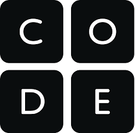

# Introducción

Crea juegos con tus alumnos, compártelos y juega desde la pantalla de tu móvil, dibuja increíbles dibujos geométricos... todo ello mientras aprendes a programar.

Con code.org aprender programación es divertido. Además te ayuda a gestionar tu clase y el progreso de tus alumnos.

**¿A qué esperas?**

