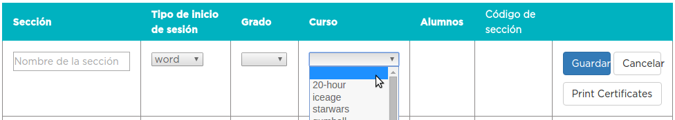
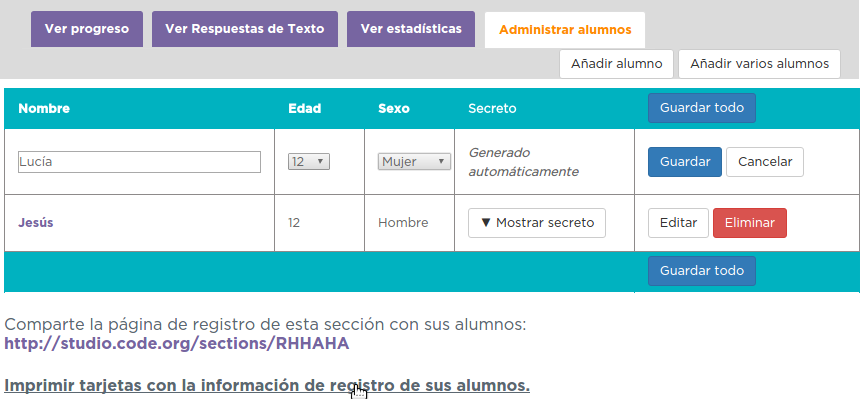
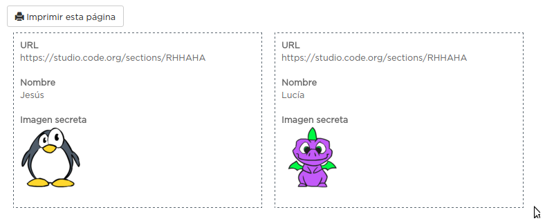
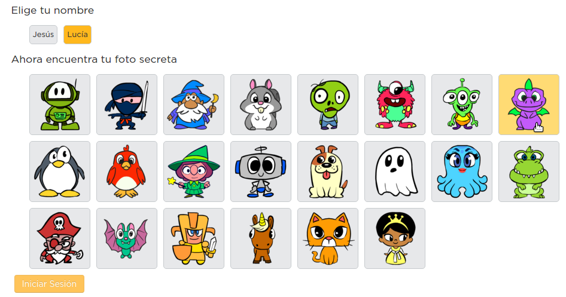
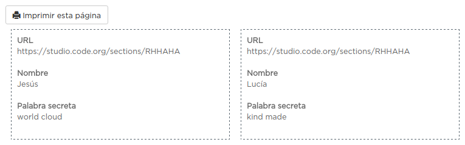
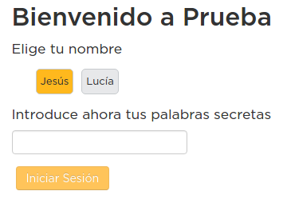
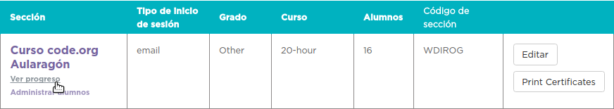
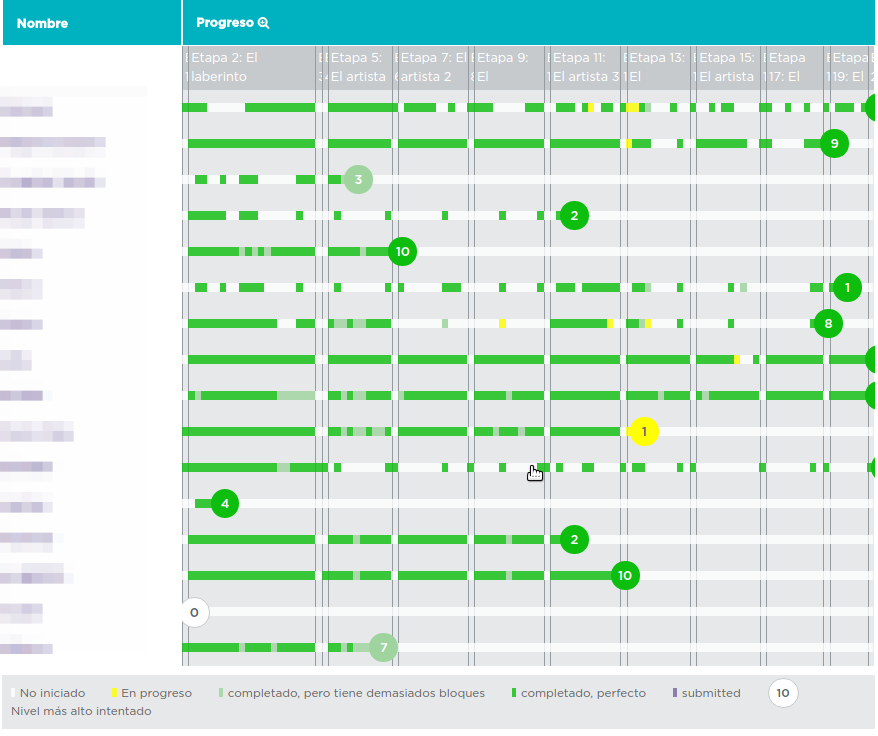
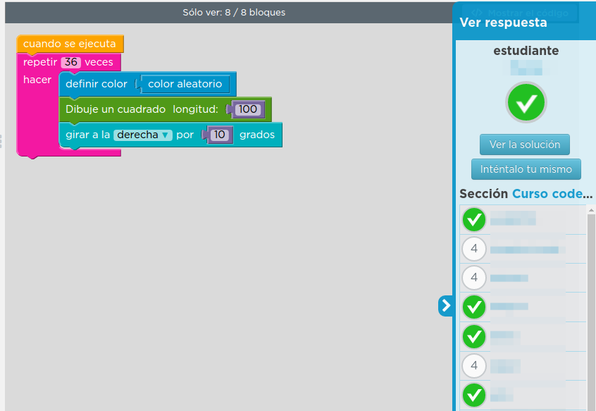

# 2. Cuentas de estudiantes y sus progresos

## Crea tu Clase e inscribe a tus alumnos

¿Quieres crear una clase? Clica en "**Nueva sección**". Dale un nombre, elige el tipo de inicio de sesión, el nivel de los alumnos a los que va destinado y el curso que quieres que realicen. No olvides guardar.

Una vez hecho esto, podrás compartir un enlace a la clase que has creado. Si elegiste **picture or word** como medio de identificación, más abajo tendrás otro link que te permitirá imprimir estas credenciales.

Atención: Si tus alumnos no tienen dirección mail, deberás escoger el **Tipo de inicio de sesión picture or word**. De está manera, los alumnos se identificarán utilizando una imagen o palabra clave que sólo ellos saben.

Acceso por imagen:

Acceso por palabra:

## Sigue el progreso de tus alumnos

Basta con clicar en "Ver progreso", debajo del nombre de la sección creada. 

Accederás a la siguiente tabla de seguimiento:

Clicando sobre el nombre de cada uno de ellos podemos ver el informe detallado de los puzzles superados y los trofeos conseguidos. Pasa también el ratón sobre las líneas de progreso de los alumnos. Si clicas en un punto determinado se abrirá el puzzle correspondiente, indicando a la derecha qué alumnos lo han realizado.

