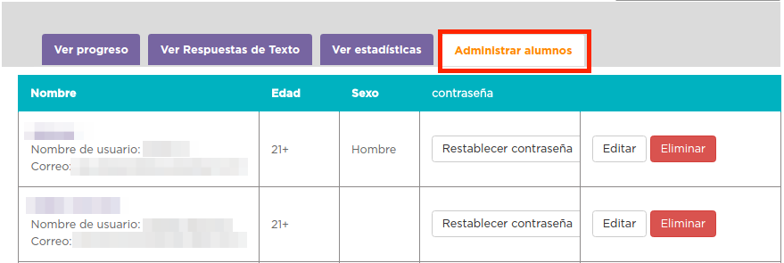

# 4. Gestiona tus alumnos e imprime sus certificados

En la página que ya conoces, donde puedes ver el progreso de tus alumnos, también podrás gestionarlos con las siguientes opciones:

¿Han completado el curso satisfactoriamente? Imprime un certificado para cada alumno con 4 clics desde tu página del maestro. ¡Quedarán así de chulos!

¡Enhorabuena! Has llegado también al final de este curso de Aularagón. ¡Buen trabajo!

No olvides consultar la oferta de cursos de code.org. **Desde tu página del maestro verás que hay más cursos disponibles de los que se muestran a los alumnos en https://studio.code.org/**.

Esperamos que hayas disfrutado de este curso y, sobre todo, que apliques lo aprendido.
