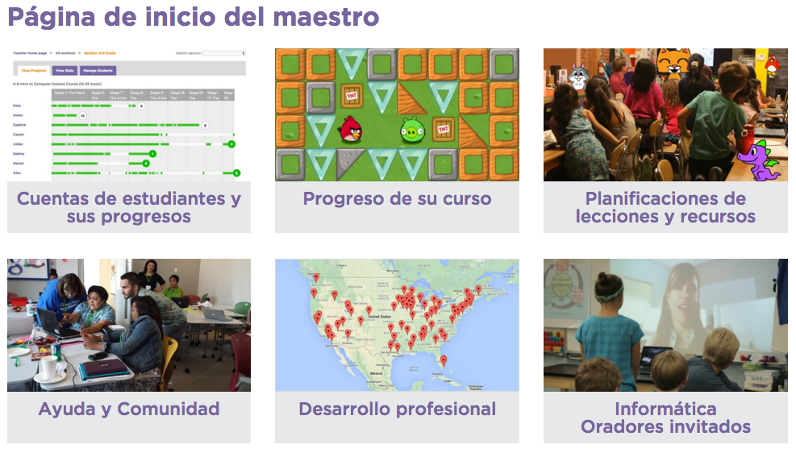
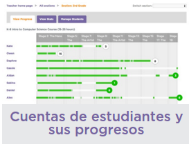

# 1. La página de inicio del maestro

Como al crear tu cuenta especificaste que eras profesor, cada vez que inicies sesión serás dirigido a la página que ves sobre estas líneas. Si por error dijiste que eras alumno, no pasa nada, puedes cambiar este parámetro editanto tu perfil. A continuación describiremos las opciones que nos ofrece cada apartado.

## Cuentas de estudiantes y sus progresos

Si avanzas con el scroll verás que tienes algunos cursos más a parte de los ofertados por defecto (algebra, informática en la ciencia y cursos anuales para bachillerato). Eso sí, están disponibles sólo en inglés de momento.

## Progreso de su curso

En este apartado se guardarán tus progresos como alumno. Puedes iniciar cualquiera de los cursos ofertados. Bajo la indicación de las edades recomendadas verás si has iniciado o no cada curso, quedando etiquetados con "Continuar" o "Probar ahora".

## Planificaciones de lecciones y recursos

Aquí tendrás acceso a material didáctico por etapas: [Planes de lecciones ](https://code.org/curriculum/course1)| [Secuencia ](https://code.org/curriculum/course1/docs/overview)| [Marco de trabajo ](https://code.org/curriculum/docs/k-5/framework_course1.pdf)| [Estándares](https://code.org/curriculum/docs/k-5/standards_course1.pdf) . Eso sí, de momento están en inglés y basados en el currículo estadounidense.

## Ayuda y comunidad

Donde podrás plantear tus dudas o buscar respuestas por temática, novedad, las más populares, las más votadas...

## Desarrollo profesional

Disponible de momento solo para profesores estadounidenses. Se trata de grupos de trabajo dirigidos por personal experimentado para ayudar a los profesores a introducir la informática en sus clases.

## Informática. Oradores invitados

Aquí podrás ponerte en contacto con algún voluntario de la comunidad para que contacte con tu clase mediante vídeo llamada, o bien acuda a tu colegio durante 1 o 2 horas. 

Puedes incluso ofrecerte tú para dar soporte a los centros de tu zona.
