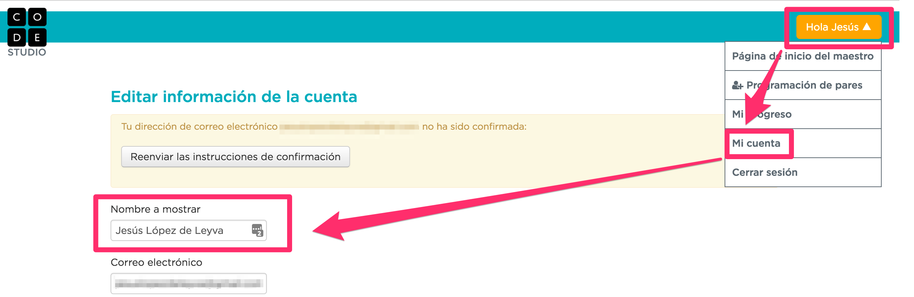

# Accediendo a la plataforma

Vayamos a https://code.org. Ya en la página principal podrás hacerte una idea de lo que ofrece el sitio. Para disfrutar de todas las funcionalidades, vamos a registrarnos.

Clica en "**iniciar sesión**", arriba a la derecha y, en la siguiente pantalla, clica en "**Registrarse**". También puedes iniciar sesión utilizando tu cuenta de Google, Facebook o Microsoft.

En la siguiente pantalla, regístrate como maestro y rellena los datos solicitados.¡Ya tendrás acceso a la página de inicio del maestro!

**¡¡¡IMPORTANTE!!!!.** Ahora, y para facilitar el seguimiento de tu progreso, accede a tu cuenta y modifica el campo ****Nombre a** mostrar** introduciendo tu nombre y apellidos. **Si no ****proporcionas** tu nombre y apellidos, no podremos identificar que realizas los puzzles  obligatorios que se mencionan en la sección **4 (Para superar este módulo)**, y **no podrás superar el curso.**

En el siguiente módulo profundizaremos en su uso. Ahora toca programar.

