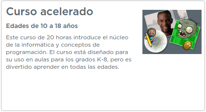
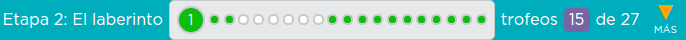
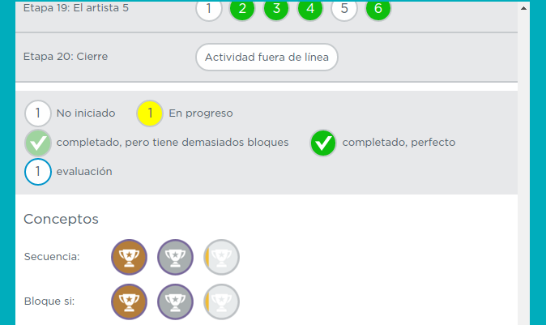
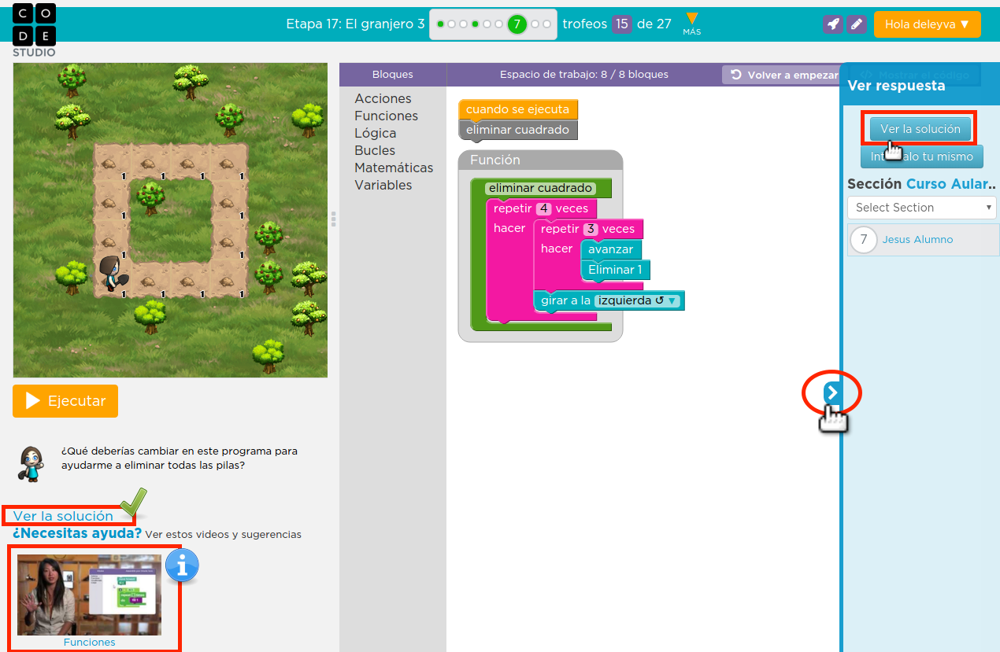

# Aprendiendo a programar

Antes de comenzar a programar con tus alumnos, vamos a coger un poco de experiencia como usuarios. Si ya te has registrado en code.org, inicia sesión y clica en el siguiente link para unirte al curso.

[https://studio.code.org/join/WDIROG](https://studio.code.org/join/WDIROG)

Busca en la página a la que accedes "Curso acelerado" con Ctrl+F.

Como podéis ver, se trata de un curso acelerado que aglutina todo lo que puedes estudiar en 4 cursos separados de 20 horas cada uno. Como la duración del mismo es superior a las horas estipuladas para el presente curso de Aularagón, hemos seleccionado sólo algunas de las actividades como obligatorias para superar este módulo. En la siguiente página especificamos cuáles son.

Veamos un par de consejos para navegar por la plataforma.

En la parte superior puedes ver un pequeño panel de navegación que indica en qué parte del curso estás y los trofeos que llevas ganados. Clicando en "Más" puedes ver un informe más detallado.

Como puedes ver, el informe nos mostrará nuestro avance por el curso con mucho detalle. Conseguiremos además trofeos. Hay 3 (bronce, plata y oro) disponibles para cada concepto de programación. Iremos ganándolos a medida que practiquemos cada bloque correspondiente.

Es recomendable que visites los apartados **Actividad fuera de línea**. Te darán una idea general de lo que vas a ver en los siguientes **puzzles**. Dentro ya de cada puzzle, tendrás siempre a mano un vídeo explicativo sobre los conceptos tratados en esa actividad en concreto. También puedes ver el ejercicio resuelto si en algún momento te encuentras atascado.

