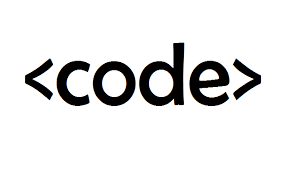

La organización comenzó como un proyecto tras investigar que en un 90% de los colegios estadounidenses no se enseñaba informática o programación. Entre sus varios objetivos se encuentran incluir la informática como materia obligatoria en el plan de educación secundaria estadounidense y el fomento de la participación de las [mujeres](https://es.wikipedia.org/wiki/Mujer) en las [ciencias de la computación](https://es.wikipedia.org/wiki/Ciencias_de_la_computaci%C3%B3n).

Son más de cien las empresas y organizaciones las que colaboran en el proyecto. Las prinicipales empresas patrocinadoras son [Amazon](https://es.wikipedia.org/wiki/Amazon), [Apple](https://es.wikipedia.org/wiki/Apple), [Dropbox](https://es.wikipedia.org/wiki/Dropbox), [Academia Khan](https://es.wikipedia.org/wiki/Khan_Academy), [Facebook](https://es.wikipedia.org/wiki/Facebook), [Google](https://es.wikipedia.org/wiki/Google) y [Microsoft](https://es.wikipedia.org/wiki/Microsoft), entre otras.#cite_note-3)

Entre sus campañas se encuentra la «Hora de Código» que pretendía que [estudiantes](https://es.wikipedia.org/wiki/Estudiante) de todo el [mundo](https://es.wikipedia.org/wiki/Mundo) participaran haciendo un curso [gratuito](https://es.wikipedia.org/wiki/Derecho_a_la_educaci%C3%B3n) de [programación](https://es.wikipedia.org/wiki/Programaci%C3%B3n). Para ello se utilizaron imágenes de los populares juegos [Plantas contra Zombis](https://es.wikipedia.org/wiki/Plantas_contra_Zombis) y *[Angry Birds](https://es.wikipedia.org/wiki/Angry_Birds)*. Los directores y productores del video presentación de la campaña «Hora de Código» fueron Nicole Ehrlich y James Gwertzman.#cite_note-4)

El proyecto es promocionado por [celebridades](https://es.wikipedia.org/wiki/Celebridad) como [Shakira](https://es.wikipedia.org/wiki/Shakira), [Angela Bassett](https://es.wikipedia.org/wiki/Angela_Bassett), [Will.i.am](https://es.wikipedia.org/wiki/Will.i.am), [Mark Zuckerberg](https://es.wikipedia.org/wiki/Mark_Zuckerberg), [Bill Gates](https://es.wikipedia.org/wiki/Bill_Gates) y [Barak Obama](https://es.wikipedia.org/wiki/Barak_Obama), entre otros.

